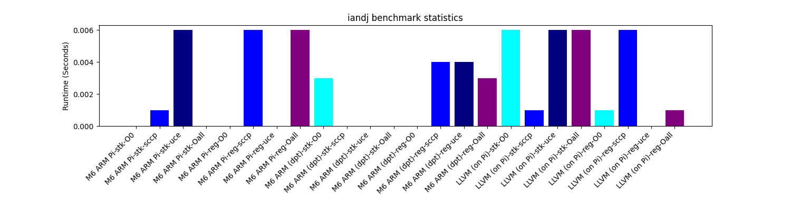
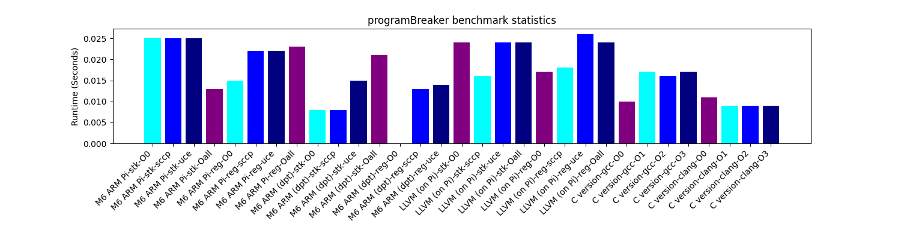

# 'OWIE

### What happens next will shock you...

By Kevin Kellar and (Mostly) Justin Privitera

## Overview

Our compiler is written in Makefile interspersed with little bits of Racket here and there. A full language breakdown is visible in Figure 1. We actually began the quarter by writing our compiler in C++, but we had a change of heart 2 days before Milestone 1 was due, and switched accordingly.

**Figure 1**


*Here you can see Github's language breakdown for our compiler.*

**Figure 2**


*This diagram gives an overview of our compiler. It displays the various phases of the compiler as well as what exactly is being passed between each phase.*

### Parsing
Our parser uses ANTLR and the provided Java parsing code to produce json files, which are then read into Racket using Racket's json library. These jsons are converted into hash tables which makes it easier to convert into our representation of an Abstract Syntax Tree (AST), which is a large number of structs representing all the different kinds of expressions, statements, as well as declarations and mini structs.

### Static Semantics
Our type checker takes in an AST and begins by building a symbol table, a struct table, and the list of functions. It then proceeds to validate both of the tables, the function main, and every other function. To validate functions, our type checker validates the declarations, then works through the statements and expressions, returning false if anything fails to typecheck. We perform return path checking via recursively checking for return equivalence on each statement in a block and succeeding if at least one statement is return equivalent.

### Intermediate Representation
The next step of our compiler is to convert an AST into a set of control flow graphs (CFGs), with one for each function. These CFGs are comprised of nodes which represent blocks of assembly code. Our CFGs contain LLVM instructions, which are represented as structs. Representing a program as a set of CFGs allows for a number of things, namely; relative ease in performing optimizations and static analysis, not to mention easy conversion to LLVM. Since LLVM is an industry standard, the optimizations and static analysis we will cover in the next section are grounded in industry practices and academic research. LLVM is flexible and well suited to performing optimizations and analysis. Additionally, since LLVM is sufficiently high-level, it can be translated to multiple different low level assembly languages. We also use Single Static Assignment (SSA Form), which has the benefit of simplifying properties of variables, forcing them to be assigned to exactly once and defined prior to being used. This has the consequence of improving the ease of performing static analysis and by extension, performing optimizations.

### Optimizations
We implemented the two following compiler optimizations.

#### Constant Propagation
We used Sparse Conditional Constant Propagation (SCCP). SCCP functions by tracking executable blocks and recording for each variable whether or not it's value is provably constant. To determine this, we abstractly interpret certain instructions, such as arithmetic and boolean instructions. The interpretation is abstract because, since many values are not known during static analysis, we use theoretical values called "top" and "bottom" to represent values which are not yet proved constant or not constant and values which are not provably constant, respectively. The result of interpreting instructions containing "top" and "bottom" is determined by special rules. Once the analysis is performed, all uses of registers that store constant values are replaced with the constants.

#### Useless Code Elimination
We use mark and sweep to eliminate useless code. We find all the essential instructions and essentially go backwards through the code, marking any instructions they depend on as essential. Once everything has been marked or left unmarked, we delete all the instructions that are not marked essential.

### Code Generation and Register Allocation
The next phase of our compiler is generating ARM Assembly. This is done by converting our intermediate representation of instructions into ARM, which is a fairly straightforward process for most instructions. After that phase is complete, we have ARM but with virtual registers. The final part of our compiler performs register allocation. To do this, we compute gen sets, kill sets, and liveout sets for each block in each CFG, and construct an interference graph using the method discussed in class. For graph coloring, we use a greedy scheme to find correct colorings of nodes. The last step is to use the generated colorings to allocate registers.

One interesting aspect of our generated ARM is that we push all callee saved registers onto the stack at the beginning of each function. We also include descriptive comments in our ARM output. These were useful for debugging purposes.

Finally, The phi instructions must be eliminated because ARM does not have phi instructions. We have to break SSA in order to eliminate the phi instructions. To do this in our compiler, we have each phi correspond to a virtual register (the cheater register) which all incoming blocks agree to assign to. Each phi instruction is then replaced with a move instruction from the cheater register to the result of the original phi instruction.

### Other
We are proud of the CI and automated testing (try running make and seeing what happens >:3) that we implemented. If we were to do this project again, we would use the knowledge from this compiler (i.e. what was difficult, organization, etc.) to inform our decisions and hopefully write a much cleaner, more elegant compiler.

## Analysis

**Figure 3**


*Our Eco-friendly natural Raspberry Pi cooling system.*

### Runtime

The following charts compare runtimes for each milestone, demonstrating the effect our optimizations had on the code, among other things.

#### Configurations:
* **stk** - stack based
* **reg** - register based
* **O0** - no optimizations
* **sccp** - applies Sparse Conditional Constant propagation (ONLY)
* **uce** - applies Useless Code Elimination (ONLY)
* **Oall** - applies applying both sccp and uce
* **clang/gcc O0-O3** - compiles the .c file with a "real" compiler and a level of optimization

#### Experiment Types

* **M6 ARM Pi** - running the result of our milestone 6 compiler on a raspberry pi
* **M6 ARM (dpt)** - running the result of our milestone 6 compiler on one of the department raspberry pis
* **LLVM (on Pi)** - running the result of our LLVM compiler on a raspberry pi (by clang-ing the .ll on the pi first)
* **C version** - running the C-equivalent of the benchmark on the same raspberry pi as the **M6 ARM Pi**

#### mixed


Our optimizations, (SCCP and UCE) are able to improve the runtime of mixed in ARM form. Notably, the stack-based LLVM (when clangified and run) perform relatively poorly compared to our conversion to ARM assembly.

####  fact_sum


This bench mark ran relatively quick, so it's unclear how appropriate it is to draw conclusions. However- it seems that our optimizations may slow down the runtime of this benchmark, while the C versions improve under optimizations.

####  simps


####  mile1


The best optimization for this benchmark is to use register based assembly!

<!--  -->
####  brett


####  creativeBenchMarkName


Similar to above: the best optimization for this benchmark is to use register based assembly. This benchmark appears to benefit very little from our optimization algorithms.

####  hailstone


####  TicTac


####  binaryConverter


Similar. Our optimizations only slightly improve the runtime of this benchmark.

<!--  -->
####  wasteOfCycles


This benchmark runs very quickly- but it's possible our optimizations slow down the runtime?

<!--  -->
<!--  -->
####  programBreaker



The set of combined optimizations appear to improve the runtime of stack based ARM!

####  Fibonacci


Even GCC and Clang struggle to optimize this benchmark. However- it's clear that those optimizations perform better than ours.

####  biggest


####  BenchMarkishTopics


Unlike many of the other benchmarks, when looking at the longer graph, it appears that stack based optimizations struggle to significantly improve performance.

<!--  -->
####  stats

####  GeneralFunctAndOptimize


Interestingly, our ARM assembly performs significantly slower than gcc/clang's O0 for this benchmark.

####  profanity


We suspect that the number of spills causes stack and register based assembly to perform similarly for this benchmark. For the ARM stack approach and the LLVM register approach- it appears that the SCCP optimization doesn't need the UCE optimization to improve runtime.

####  bert


####  hanoi_benchmark


One of the best graphs we made!

####  killerBubbles


<!--  -->
####  primes


This plot looks similar to the mixed plot. For whatever reason, our own ARM generation is able to out perform clang's ARM generation (when it uses our LLVM IR).

####  OptimizationBenchmark


This plot suggests that our optimizations improve register based assembly, but fails to improve the stack based implementations.

### Instruction Count

The following charts detail the differences in instruction count before and after optimizations for each benchmark, as well as some custom files. Additionally, each chart shows 4 variants of each program, LLVM stack based, LLVM register based, ARM stack based, and ARM register based. The red color shows the line count prior to optimization, and the orange shows the line count afterwards. The same is true of blue and cyan, respectively.

As can be seen in many of these plots, the stack based approach is not able to be optimized very much, while register based is almost always an improvement.

#### mixed


####  fact_sum


####  simps


####  mile1


The best optimization for this benchmark is to use register based assembly!

####  brett

####  creativeBenchMarkName


####  hailstone

####  TicTac

####  binaryConverter


<!--  -->
####  wasteOfCycles


####  programBreaker


####  Fibonacci


####  biggest

####  BenchMarkishTopics


####  stats

####  GeneralFunctAndOptimize


####  profanity


####  bert

####  hanoi_benchmark


####  killerBubbles

####  primes


####  OptimizationBenchmark


## Conclusion

### Notes
An interesting project would be to investigate why ARM code generated by clang reading our intermediate representation fails to outperform our own ARM generation for primes and mixed.

Our code quality suffered early in the quarter, and we began to unconsciously prioritize the shock factor when reading surprising lines of code over writing clear code.

### Final Words

This class was unique in that it felt like a sort of a capstone class. What we mean by that is it applied concepts from almost all of the major courses that we have taken over the past 4 years, including but not limited to Systems Programming, Programming Languages, Algorithms, Data Structures, Software Engineering, and Computer Architecture, to name a few. It was undoubtedly comprehensive, and we are glad we were able to complete the compiler in its entirety. Given more time, we would take time to refine our work, improve the code quality, and investigate performance discrepancies that are apparent in the Analysis section of this paper. Given even more time, we would start from scratch (for the 3rd time), using the learnings from this class to inform our process and decision making.

## Appendix A: Additional Mini Programs Used in Testing

### Profanity

profanity.mini

```
fun PrintOnesOnly(int width) void
{
    PrintLine(width, 101000, 0, false, true);
}

fun PrintLeftAnd(int width, int leftcount, int num, int thicc) void
{
    int i;
    i = 0;
    while (i < leftcount)
    {
        print 1;
        i = i + 1;
    }
    PrintLine(width - leftcount, num - leftcount, thicc, false, false);
}

fun PrintLine(int width, int num, int thicc, bool mirrored,
              bool oppositeday) void
{
    int i;
    bool temp;
    bool do0;

    i = 0;
    while (i <= width)
    {
	temp = (i < num || (mirrored && i > width - num));
	do0 = ((!temp) && (i < num + thicc || (i > width - num - thicc && mirrored))) ;
        if ((oppositeday && do0) || (!oppositeday && !do0))
        {
            if (i == width)
            {
                print 0 endl;
            }
            else
            {
                print 0;
            }
        }
        else
        {
            if (i == width)
            {
                print 1 endl;
            }
            else
            {
                print 1;
            }
        }
        i = i + 1;
    }
}

fun PrintF() void
{
    int i;
    PrintOnesOnly(40);
    PrintOnesOnly(40);

    i = 0;
    while (i < 6)
    {
        PrintLeftAnd(40, 5, 100000, 0);
        i = i + 1;
    }

    PrintLeftAnd(40, 20, 100000, 0);
    PrintLeftAnd(40, 20, 100000, 0);

    i = 0;
    while (i < 20 - 6 - 6)
    {
        PrintLeftAnd(40, 5, 100000, 0);
        i = i + 1;
    }
}

fun PrintC() void
{
    int i;
    PrintOnesOnly(40);
    PrintOnesOnly(40);
    PrintOnesOnly(40);

    i = 0;
    while (i < 12)
    {
        PrintLeftAnd(40, 6, 100000, 0);
        i = i + 1;
    }

    PrintOnesOnly(40);
    PrintOnesOnly(40);
    PrintOnesOnly(40);
}

fun PrintU() void
{
    int i;
    int j;
    int to;
    i = 0;
    while (i < 21)
    {
        if (i < 8)
        {
            to = 3;
        }
        else
        {
            if (i / 3 * 3 == i)
            {
                to = 1;
            }
            else
            {
                to = 0;
            }
        }
        j = 0;
        while (j < to)
        {
            PrintLine(40, i, 4, true, false);
            j = j + 1;
        }
        i = i + 2;
    }
}

fun PrintK() void
{
    int i;
    int temp;
    i = 0;
    while (i < 80)
    {
        temp = 40 - i;
        if (temp < 5)
        {
            temp = temp - 5;
            temp = 0 - temp;
            temp = temp - 5;
        }
        PrintLeftAnd(40, 5, temp - 8, 8);
        i = i + 4;
    }
}

fun beprofane(int width) void
{
    PrintF();
    print 1 endl;
    print 1 endl;
    PrintU();
    print 1 endl;
    print 1 endl;
    PrintC();
    print 1 endl;
    print 1 endl;
    PrintK();
}

fun main() int
{
    beprofane(200);
    return 0;
}
```

### Simps

simps.mini

```
struct Calibration
{
    int calibration;
    int roll;
    int pitch;
    int yaw;
};

struct Simple
{
    int one;
    struct Calibration cal;
};

struct Simps
{
    bool isSimpy;
    struct Simple mySimp;
    struct Simps nextSimp;
};

fun makeSimps(int simpcount) struct Simps
{
    int i;
    struct Simps firstSimp;
    struct Simps currentSimp;
    struct Simps prevSimp;

    i = 0;
    firstSimp = null;
    prevSimp = null;
    currentSimp = null;
    while (i < simpcount)
    {
        currentSimp = new Simps;
        currentSimp.mySimp = new Simple;
        currentSimp.mySimp.one = i * i;
	currentSimp.nextSimp = null;
        if (false == (prevSimp == null))
        {
            prevSimp.nextSimp = currentSimp;
        }
        else
        {
            firstSimp = currentSimp;
        }
        prevSimp = currentSimp;

        i = i + 1;
    }
    return firstSimp;
}

fun twitchDonation(struct Simps s) void
{
    while (false == (s == null))
    {
        s.mySimp.one = s.mySimp.one * s.mySimp.one;
        s = s.nextSimp;
    }
}

fun amazonWishlist(struct Simps s) int
{
    int dollars;

    dollars = 0;
    while (false == (s == null))
    {
        dollars = dollars + s.mySimp.one;
        s = s.nextSimp;
    }

    return dollars;
}

fun freedom(struct Simps s) void
{
    struct Simps next;
    while (false == (s == null))
    {
        next = s.nextSimp;
        delete s.mySimp;
        delete s;
        s = next;
    }
}

fun main() int
{
    struct Simps theSimps;
    int tmp;

    theSimps = makeSimps(4);
    twitchDonation(theSimps);
    tmp = amazonWishlist(theSimps);
    if (!(tmp == 98))
    {
        return 3;
    }

    freedom(theSimps);

    theSimps = makeSimps(81);
    twitchDonation(theSimps);
    if (amazonWishlist(theSimps) != 676010664)
    {
        return 4;
    }

    freedom(theSimps);
    return 0;
}

```


